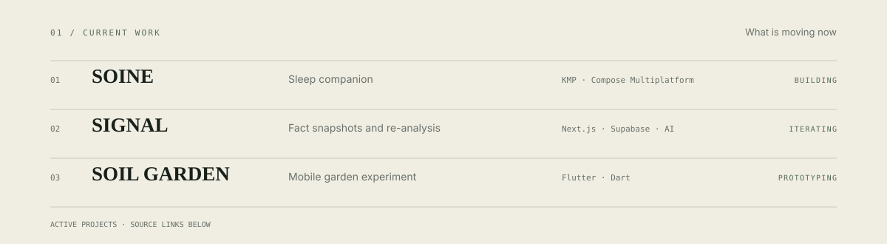
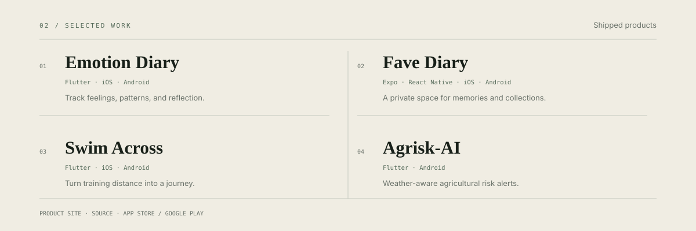
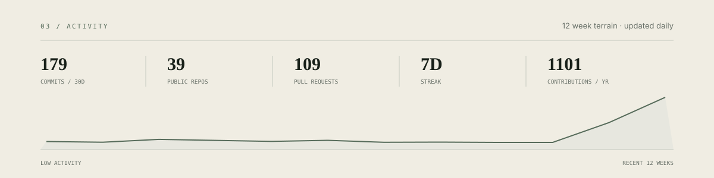
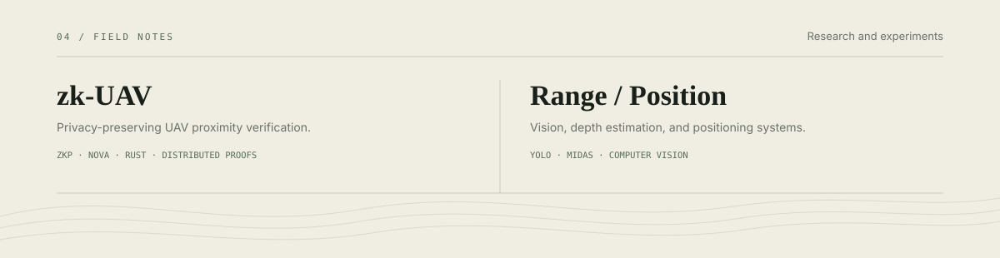

<picture>
  <source media="(prefers-color-scheme: dark)" srcset="./assets/profile/hero-dark.svg">
  <source media="(prefers-color-scheme: light)" srcset="./assets/profile/hero-light.svg">
  
</picture>

<picture>
  <source media="(prefers-color-scheme: dark)" srcset="./assets/profile/current-dark.svg">
  <source media="(prefers-color-scheme: light)" srcset="./assets/profile/current-light.svg">
  
</picture>

  <a href="https://github.com/SMRI2170/soine">Soine ↗</a> · <a href="https://github.com/SMRI2170/signal">SIGNAL ↗</a> · <a href="https://github.com/SMRI2170/Official-Website-of-soil-garden">Soil Garden ↗</a>

<picture>
  <source media="(prefers-color-scheme: dark)" srcset="./assets/profile/selected-work-dark.svg">
  <source media="(prefers-color-scheme: light)" srcset="./assets/profile/selected-work-light.svg">
  
</picture>

  
    <a href="https://smri2170.github.io/Official-Website-of-Emotion-Diary/">Emotion Diary</a> ·
    <a href="https://github.com/SMRI2170/emotion-Diary">source</a> ·
    <a href="https://apps.apple.com/jp/app/emotion-diary-see-the-waves/id6757458952">App Store</a> ·
    <a href="https://play.google.com/store/apps/details?id=jp.smri.emo0708">Google Play</a>
    &nbsp;&nbsp; / &nbsp;&nbsp;
    <a href="https://smri2170.github.io/Official-Website-of-oshi-diary/">Fave Diary</a> ·
    <a href="https://github.com/SMRI2170/oshi">source</a>
  

  
    <a href="https://smri2170.github.io/Official-Website-of-Swim-Across/">Swim Across</a> ·
    <a href="https://github.com/SMRI2170/swim-across">source</a>
    &nbsp;&nbsp; / &nbsp;&nbsp;
    <a href="https://smri2170.github.io/Official-Website-of-Agrimanager/">Agrisk-AI</a> ·
    <a href="https://github.com/SMRI2170/agriculture0716">source</a>
  

<picture>
  <source media="(prefers-color-scheme: dark)" srcset="./assets/profile/generated/activity-dark.svg">
  <source media="(prefers-color-scheme: light)" srcset="./assets/profile/generated/activity-light.svg">
  
</picture>

<picture>
  <source media="(prefers-color-scheme: dark)" srcset="./assets/profile/research-dark.svg">
  <source media="(prefers-color-scheme: light)" srcset="./assets/profile/research-light.svg">
  
</picture>

  <a href="https://github.com/SMRI2170/zerosky-opendroneid">zk-UAV ↗</a> · <a href="https://github.com/SMRI2170/Range-and-Positioning-System">Range & Positioning ↗</a>

