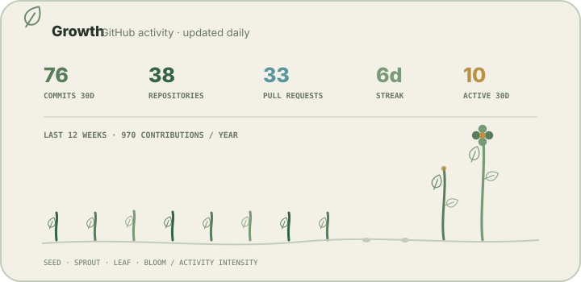
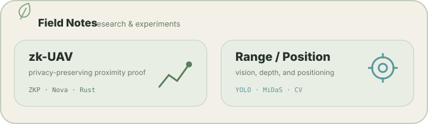

<picture>
  <source media="(prefers-color-scheme: dark)" srcset="./assets/profile/hero-dark.svg">
  <source media="(prefers-color-scheme: light)" srcset="./assets/profile/hero-light.svg">
  
</picture>

## Growing

<picture>
  <source media="(prefers-color-scheme: dark)" srcset="./assets/profile/growing-dark.svg">
  <source media="(prefers-color-scheme: light)" srcset="./assets/profile/growing-light.svg">
  
</picture>

## Growth

<picture>
  <source media="(prefers-color-scheme: dark)" srcset="./assets/profile/generated/growth-dark.svg">
  <source media="(prefers-color-scheme: light)" srcset="./assets/profile/generated/growth-light.svg">
  
</picture>

## Projects

<table>
<tr>
<td width="50%" valign="top" align="center">

 
<a href="https://apps.apple.com/jp/app/emotion-diary-see-the-waves/id6757458952">App Store</a> · <a href="https://play.google.com/store/apps/details?id=jp.smri.emo0708">Google Play</a>
</td>
<td width="50%" valign="top" align="center">

 
<a href="https://apps.apple.com/jp/app/%E6%8E%A8%E3%81%97%E6%B4%BB%E6%97%A5%E8%A8%98/id6751962585">App Store</a> · <a href="https://play.google.com/store/apps/details?id=com.ryosuke.oshikatu">Google Play</a>
</td>
</tr>
<tr>
<td width="50%" valign="top" align="center">

 
<a href="https://apps.apple.com/jp/app/swim-across/id6752210415">App Store</a> · <a href="https://play.google.com/store/apps/details?id=com.ryosuke.swimming_trip">Google Play</a>
</td>
<td width="50%" valign="top" align="center">

 
<a href="https://play.google.com/store/apps/details?id=com.ryosuke.agriculture0716">Google Play</a>
</td>
</tr>
</table>

## Field Notes

<picture>
  <source media="(prefers-color-scheme: dark)" srcset="./assets/profile/field-notes-dark.svg">
  <source media="(prefers-color-scheme: light)" srcset="./assets/profile/field-notes-light.svg">
  
</picture>

  <a href="https://github.com/SMRI2170/zerosky-opendroneid">zk-UAV ↗</a> · <a href="https://github.com/SMRI2170/Range-and-Positioning-System">Range & Positioning ↗</a>

