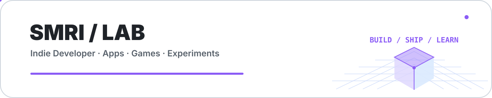
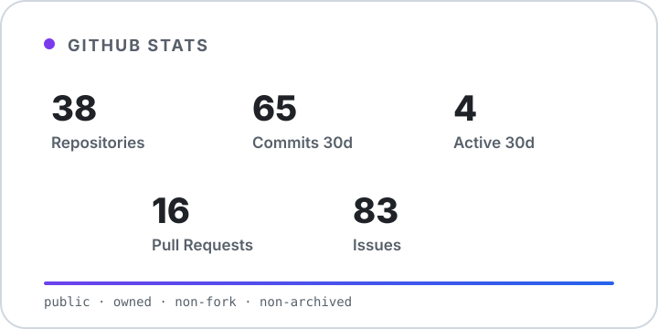
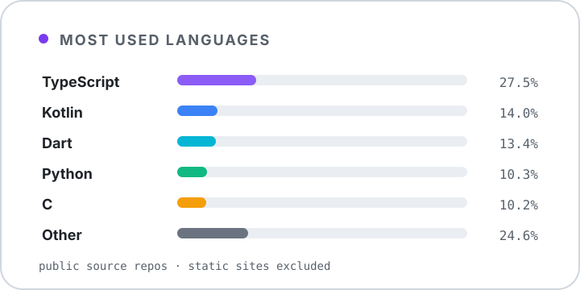
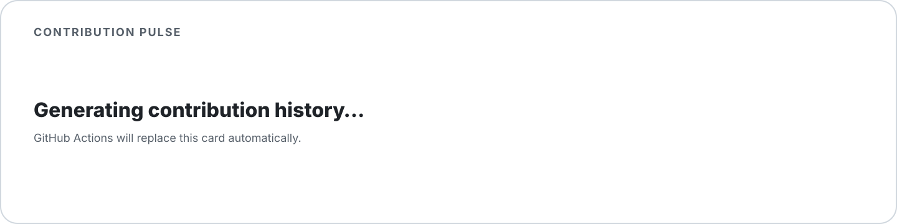
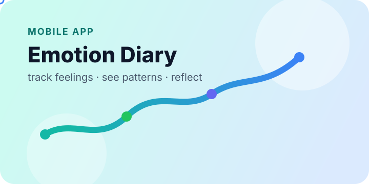
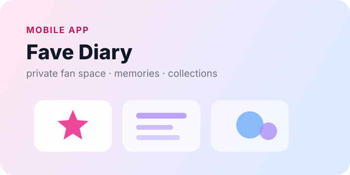
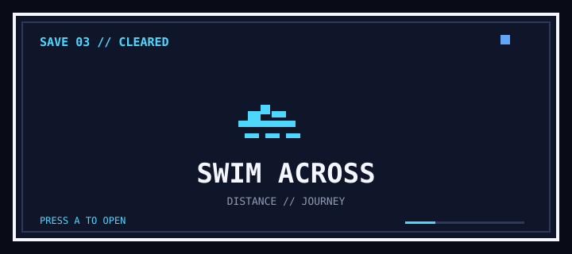
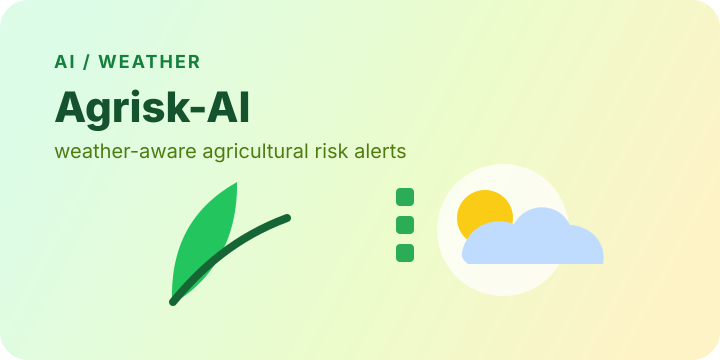

<picture>
  <source media="(prefers-color-scheme: dark)" srcset="./assets/profile/hero-dark.svg">
  <source media="(prefers-color-scheme: light)" srcset="./assets/profile/hero-light.svg">
  
</picture>

**Mobile · Web · AI · Games**

Building small products, shipping fast, and learning from every release.

---

## GitHub Dashboard

<table>
<tr>
<td width="50%" valign="top">

<picture>
  <source media="(prefers-color-scheme: dark)" srcset="./assets/profile/generated/stats-dark.svg">
  <source media="(prefers-color-scheme: light)" srcset="./assets/profile/generated/stats-light.svg">
  
</picture>

</td>
<td width="50%" valign="top">

<picture>
  <source media="(prefers-color-scheme: dark)" srcset="./assets/profile/generated/languages-dark.svg">
  <source media="(prefers-color-scheme: light)" srcset="./assets/profile/generated/languages-light.svg">
  
</picture>

</td>
</tr>
</table>

---

## Contribution Activity

<picture>
  <source media="(prefers-color-scheme: dark)" srcset="./assets/profile/generated/contribution-dark.svg">
  <source media="(prefers-color-scheme: light)" srcset="./assets/profile/generated/contribution-light.svg">
  
</picture>

---

## Tech Stack

<picture>
  <source media="(prefers-color-scheme: dark)" srcset="https://skillicons.dev/icons?i=kotlin,androidstudio,flutter,dart,ts,react,nextjs,supabase,postgres,rust,py,threejs,git,github,githubactions&theme=dark&perline=8">
  <source media="(prefers-color-scheme: light)" srcset="https://skillicons.dev/icons?i=kotlin,androidstudio,flutter,dart,ts,react,nextjs,supabase,postgres,rust,py,threejs,git,github,githubactions&theme=light&perline=8">
  
</picture>

Kotlin / KMP · Flutter · TypeScript · React · Next.js · Supabase · PostgreSQL · Rust · Python · Three.js · GitHub Actions

---

## Now Building

### Soine `BUILDING`
A Kotlin Multiplatform sleep companion where going to bed becomes time spent with a small creature.

`Kotlin Multiplatform` · `Compose Multiplatform` · `Local-first`

### [SIGNAL](https://github.com/SMRI2170/signal) `BUILDING`
A fact-based relationship analysis product that turns observable events into consistent AI-assisted snapshots.

`Next.js` · `Kotlin Multiplatform` · `Supabase` · `AI`

### Soil Garden `RELEASE PREP`
A Flutter garden simulation for growing and collecting unusual plants.

`Flutter` · `Dart` · `Mobile`

---

## Shipped

<table>
<tr>
<td width="50%" valign="top">

### Emotion Diary

Track daily emotions and turn them into patterns you can actually look back on.

`Flutter` · `Charts` · `Local-first`

[Website](https://smri2170.github.io/Official-Website-of-Emotion-Diary/) · [App Store](https://apps.apple.com/jp/app/emotion-diary-see-the-waves/id6757458952) · [Google Play](https://play.google.com/store/apps/details?id=jp.smri.emo0708)

</td>
<td width="50%" valign="top">

### Fave Diary

A private fan space for memories, schedules, merchandise and spending.

`Flutter` · `Hive` · `Offline-first`

[Website](https://smri2170.github.io/Official-Website-of-oshi-diary/) · [App Store](https://apps.apple.com/jp/app/%E6%8E%A8%E3%81%97%E6%B4%BB%E6%97%A5%E8%A8%98/id6751962585) · [Google Play](https://play.google.com/store/apps/details?id=com.ryosuke.oshikatu)

</td>
</tr>
<tr>
<td width="50%" valign="top">

### Swim Across

Turn swim training into a map-based journey with goals, logs and custom workouts.

`Flutter` · `OpenStreetMap` · `Fitness`

[Website](https://smri2170.github.io/Official-Website-of-Swim-Across/) · [App Store](https://apps.apple.com/jp/app/swim-across/id6752210415) · [Google Play](https://play.google.com/store/apps/details?id=com.ryosuke.swimming_trip)

</td>
<td width="50%" valign="top">

### Agrisk-AI

Weather-aware agricultural risk alerts designed to make daily field decisions easier.

`Flutter` · `AI` · `Weather`

[Website](https://smri2170.github.io/Official-Website-of-Agrimanager/) · [Google Play](https://play.google.com/store/apps/details?id=com.ryosuke.agriculture0716)

</td>
</tr>
</table>

---

## Public Build Log

Latest public work from the last 7 days · private repositories and this profile repository are excluded.

<!-- activity:start -->
- [`resume-research-progress`](https://github.com/SMRI2170/resume-research-progress) · `Oct 6` — `Publish company research progress dashboard`
- [`signal`](https://github.com/SMRI2170/signal) · `Oct 3` — `fix(native): fail closed on missing judge API`
<!-- activity:end -->

---

## Lab / R&D

Outside product development, I explore privacy-preserving systems and computer vision.

**[zk-UAV Proximity Proof](https://github.com/SMRI2170/zerosky-opendroneid)**  
Exploring zero-knowledge proofs for drone proximity checks, combining Circom / Groth16, BLE Remote ID and a mobile prototype.

**[Range & Positioning System](https://github.com/SMRI2170/Range-and-Positioning-System)**  
A computer-vision experiment combining YOLOv8 and MiDaS to estimate a person's relative depth and camera-space position from images.

---

<b>build / ship / repeat</b>

