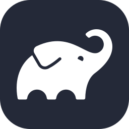
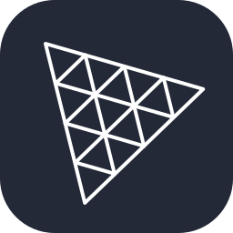
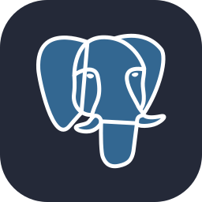
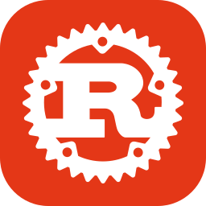
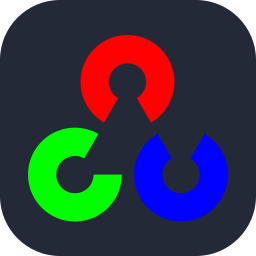
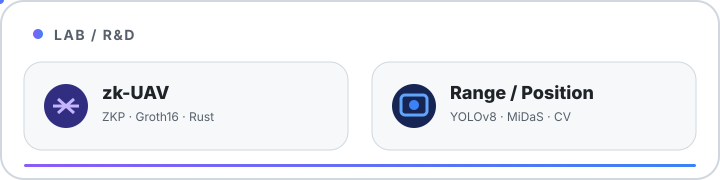

<picture>
  <source media="(prefers-color-scheme: dark)" srcset="./assets/profile/hero-dark.svg">
  <source media="(prefers-color-scheme: light)" srcset="./assets/profile/hero-light.svg">
  
</picture>

**Mobile · Web · AI · Games**

Building small products, shipping fast, and learning from every release.

---

## GitHub Dashboard

<picture>
  <source media="(prefers-color-scheme: dark)" srcset="./assets/profile/generated/stats-dark.svg">
  <source media="(prefers-color-scheme: light)" srcset="./assets/profile/generated/stats-light.svg">
  
</picture>

<picture>
  <source media="(prefers-color-scheme: dark)" srcset="./assets/profile/generated/languages-dark.svg">
  <source media="(prefers-color-scheme: light)" srcset="./assets/profile/generated/languages-light.svg">
  
</picture>

---

## Contribution Activity

<picture>
  <source media="(prefers-color-scheme: dark)" srcset="./assets/profile/generated/contribution-dark.svg">
  <source media="(prefers-color-scheme: light)" srcset="./assets/profile/generated/contribution-light.svg">
  
</picture>

---

## Tech Stack

<b>MOBILE / APP</b>  

  
<b>WEB / UI</b>  

  
<b>DATA / CLOUD</b>  

  
<b>SYSTEMS / AUTOMATION</b>  

---

## Now Building

<picture>
  <source media="(prefers-color-scheme: dark)" srcset="./assets/profile/now-building-dark.svg">
  <source media="(prefers-color-scheme: light)" srcset="./assets/profile/now-building-light.svg">
  
</picture>

<a href="https://github.com/SMRI2170/signal">SIGNAL repository ↗</a>

---

## Shipped

<table>
<tr>
<td width="50%" valign="top" align="center">

 
<a href="https://apps.apple.com/jp/app/emotion-diary-see-the-waves/id6757458952">App Store</a> · <a href="https://play.google.com/store/apps/details?id=jp.smri.emo0708">Google Play</a>
</td>
<td width="50%" valign="top" align="center">

 
<a href="https://apps.apple.com/jp/app/%E6%8E%A8%E3%81%97%E6%B4%BB%E6%97%A5%E8%A8%98/id6751962585">App Store</a> · <a href="https://play.google.com/store/apps/details?id=com.ryosuke.oshikatu">Google Play</a>
</td>
</tr>
<tr>
<td width="50%" valign="top" align="center">

 
<a href="https://apps.apple.com/jp/app/swim-across/id6752210415">App Store</a> · <a href="https://play.google.com/store/apps/details?id=com.ryosuke.swimming_trip">Google Play</a>
</td>
<td width="50%" valign="top" align="center">

 
<a href="https://play.google.com/store/apps/details?id=com.ryosuke.agriculture0716">Google Play</a>
</td>
</tr>
</table>

---

## Public Build Log

<!-- activity:start -->
- [`resume-research-progress`](https://github.com/SMRI2170/resume-research-progress) · `Oct 6` — `Publish company research progress dashboard`
- [`signal`](https://github.com/SMRI2170/signal) · `Oct 3` — `fix(native): fail closed on missing judge API`
<!-- activity:end -->

---

## Lab / R&D

<picture>
  <source media="(prefers-color-scheme: dark)" srcset="./assets/profile/lab-dark.svg">
  <source media="(prefers-color-scheme: light)" srcset="./assets/profile/lab-light.svg">
  
</picture>

<a href="https://github.com/SMRI2170/zerosky-opendroneid">zk-UAV ↗</a> · <a href="https://github.com/SMRI2170/Range-and-Positioning-System">Range & Positioning ↗</a>

---

## Contribution Snake

<picture>
  <source media="(prefers-color-scheme: dark)" srcset="./assets/profile/generated/contribution-snake-dark.svg">
  <source media="(prefers-color-scheme: light)" srcset="./assets/profile/generated/contribution-snake.svg">
  
</picture>

---

<b>build / ship / repeat</b>

